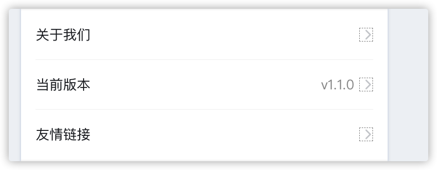
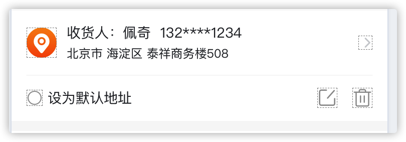
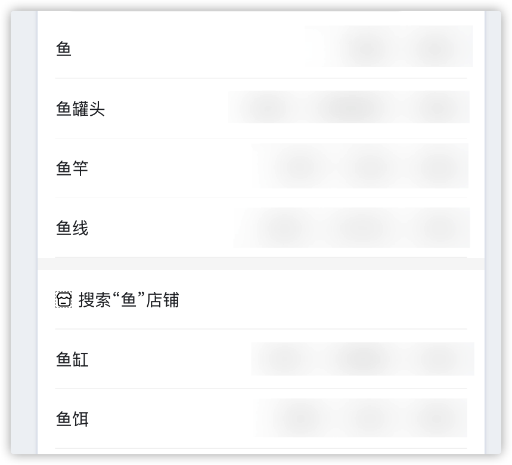
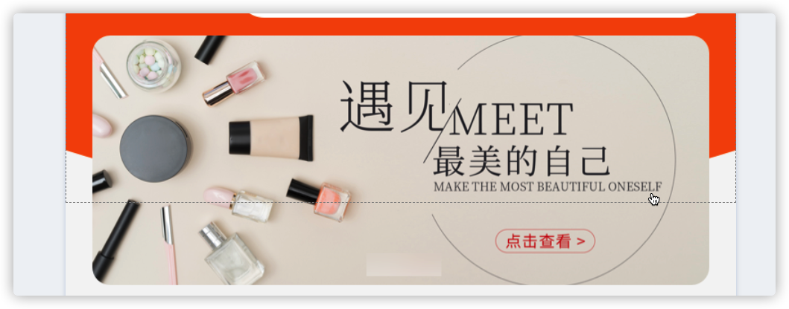
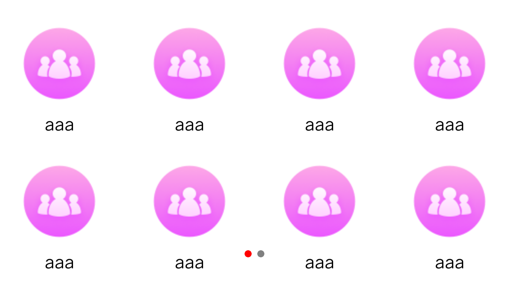
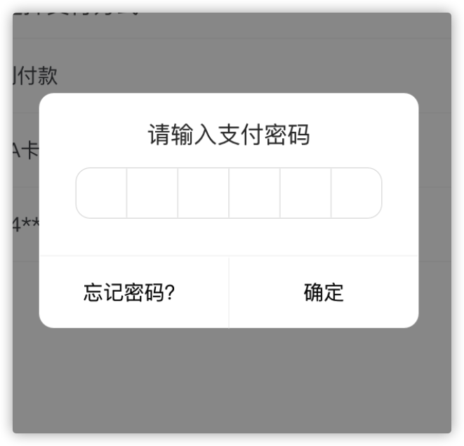
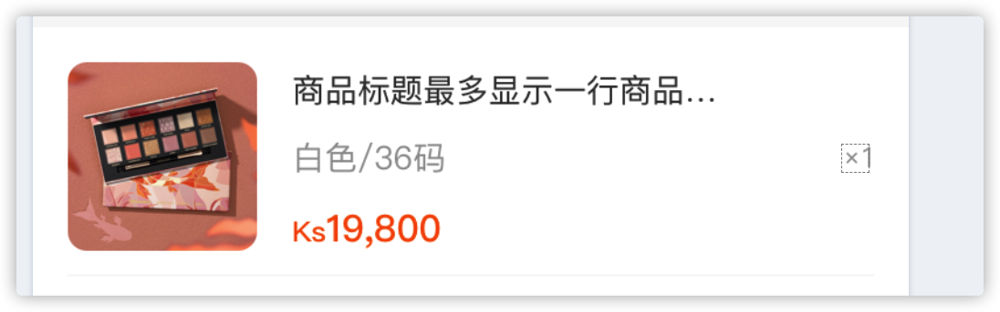

# 请把 m-only-cpt 文件夹放入项目的components文件夹内

***
# cell 类组件

## settingCell 组件 

如果该组件功能无法满足,可使用官方的 act 组件中的 cell

### 样式

### 属性

高 48  带下边框线, 离左右各 14px 两端对齐 水平居中

### 引入

~~~js
import settingCell from '../../components/m-only-cpt/setting_cell.stml'
~~~

### 用法

~~~html
<setting-cell title="意见反馈" :rightText="version" onclick="test()" />
~~~

### 属性
  |属性                 |类型        |说明                               |是否必填         |默认值                                  |值
  :---:|:--:|:---:|:---:|:---:|:---:
  |title                |String     |左侧标题文字                        |是               |无                                    | 任意文字
  |rightText            |String     |右侧标题文字                        |否               |无                                    | 任意文字
  |hideRightArrow       |boolean    |是否隐藏右侧箭头                     |否               |false                                 | true,false
  |r-text-color         |String     |右侧文字颜色                        |否               |#999                                   | 6 位颜色代码
 
### 备注

rightText 右侧箭头左边的文字,不填为不显示

***
# 商品列表类组件

## goods-cell 组件

### 样式

### 引入
~~~js
import goodsCell from '../../components/m-only-cpt/goods-cell.stml'
~~~

### 用法

~~~html
<goods-cell :list="list" :bottomText='' @nextList="nextList()" @openGoods="openGoods" />
~~~

### list 属性
  |属性                 |类型        |说明                       |是否必填         |默认值                                  |值
  :---:|:--:|:---:|:---:|:---:|:---:
  |name                |String     |标题                        |是               |无                                    | 任意文字
  |img_url             |String     |图片                        |否               |无                                    | 任意文字
  |sku_price           |String     |显示价格                     |否               |无                                    | 任意
  |sku_original_price  |String     |划线价                       |否               |无                                    | 任意
  |is_free_shipping    |Number     |显示包邮字段                  |否               |0                                    | 0,1
  |goods_tag_name      |String     |商品标签                      |否               |无                                   | [...]
  |service_tag_names   |arr        |服务标签(数组,显示为 第一 个)   |否               |无                                   | [...]

### 非 list 属性
  |属性                 |类型        |说明                       |是否必填         |默认值                                  |值
  :---:|:--:|:---:|:---:|:---:|:---:
  |bottomText          |String     |上滑加载文字                 |否               |无                                    | 任意文字

### 备注

@nextList => 加载下一页的事件

@openGoods => 点击item 事件

***
# 地址类组件

## address-cell 组件

### 样式

### 引入

~~~js
import AddressCell from '../../components/m-only-cpt/address-cell.stml'
~~~

### 用法

~~~html
<address-cell :list="list" @setDefault="setDefault" @edit="edit" @del="del" @nextList="addPage()" />
~~~

list => 传入数组 => 包含字段:

name => 收件人姓名   tel=>联系电话   map_address=> 地图定位地址  is_defaulted=> 是否为默认地址

### list属性
  |属性                 |类型        |说明                       |是否必填         |默认值                                  |值
  :---:|:--:|:---:|:---:|:---:|:---:
  |name                |String     |收件人姓名                   |是              |无                                    | 任意文字
  |tel                 |String     |收件人电话                   |是              |无                                    | 任意文字
  |map_address         |String     |地图定位地址                  |是              |无                                    | 任意文字
  |is_defaulted        |String     |是否为默认地址                |是              |无                                    | 任意文字

### 备注

@setDefault 设置为默认地址事件 => 只能取到 index => e.detail

@edit 点击修改按钮事件 => 只能取到 index => e.detail

@del 点击删除按钮事件 => 只能取到 index => e.detail

@nextList  加载下一页内容事件

@select  点击当前地址事件

***

# 预搜索类组件

## search-page 组件

### 样式

### 引入

~~~js
import SearchPage from "../../components/m-only-cpt/search-page.stml";
~~~

### 用法

~~~html
<search-page :lists="this.data.lists" cellType_1='goods' cellType_2="cateName" cellType_3="cate"cellType_2_text="分类" :cellHeight="48" cellType_2_img="../../image/o-001.png" oncellTypeClick1="searh_goods"oncellTypeClick2="search_cate" :iconWidth="10" :iconHeight="10" />
~~~

### props 属性
  属性|类型|说明|是否必填|默认值|值
  :---:|:--:|:---:|:---:|:---:|:---:
  lists|arr|传入已经整理好的数组|是|无|[...]
  cellType_1|String|预搜索关键词列表标签|是|无                                      
  cellType_2|String|预搜索关键词分割栏|否|无                                      
  cellType_3|String|预搜索关键词列表2标签|否|无                                      
  cellType_2_text|String|预搜索关键词列表分隔栏文字|否|无
  cellType_2_img|String|预搜索关键词分割栏图标|是|无|不填会导致样式有问题
  iconWidth|Number|图标宽|否|10px|支持5-20px
  iconHeight|Number|图标高|否|10px|支持5-20px
  cellHeight|Number|每一行的高度|否|48px|支持20px-70px

  ### 备注
cellType_1,cellType_3 参照 list-view 下的 cellTypeKey,也就是  cell 下的 cellType 属性

###  事件
cellTypeClick1   单击预搜索关键词列表1事件

cellTypeClick2   单击预搜索关键词列表2事件

***

# 轮播图类组件

## home-swiper 组件

### 样式

### 引入

~~~js
import homeSwiper from "../../components/m-only-cpt/home-swiper.stml";
~~~

### 说明

该组件,自动宽度百分百撑满,所以需要 特殊宽度的,请在 组件外,包一层 view, 设置好需要的宽度即可,支持 分页器的 隐藏, 自定义,默认 样式

### 用法

~~~html
<home-swiper :lists="goodsImg" @qcSwiperIndex="getSwiperIndex" :autoplay='false' :height="140" :border-radius="40" :indicator="hidden" :default-indicator="" :custom-indicator=""/>
~~~

### props 属性(分页器样式请参考apicloud文档中的swiper组件)
  |属性                 |类型          |说明                               |是否必填         |默认值        |值
  :---:|:--:|:---:|:---:|:---:|:---:
  |lists                |arr          |传入以图片地址构成的数组               |是               |无         |[...]
  |autoplay             |boolean      |轮播图是否自动播放                    |否               |false      |false,true
  |height               |number       |轮播图高度                           |是               |无         |
  |border-radius        |number       |轮播图圆角                           |是               |无         |
  |indicator            |string       |分页器状态                           |是               |无         |default,custom,hidden
  |default-indicator    |obj          |默认指示器样式(indicator为default时必填)  |否            |无         |{indicator-color:,indicator-active-color:,}
  |custom-indicator     |obj          |自定义指示器样式(indicator为custom时必填)  |否            |无         |{active:{可直接输入css属性},normal:{可直接输入css属性}}

###  事件
qcSwiperIndex swiper滑动后返回的当前图片index; 可用该 index 制作 swiper 的 分页器

###  接收事件
pageUpdate  用于刷新swiper组件, 如果碰到页面刷新需要重置swiper, 请在获取完成新数据之后发送该事件

##  classification  分类分页组件

### 样式

### 引入

~~~js
import classification from "../../components/m-only-cpt/classification.stml";
~~~

### 说明

该组件,自动宽,高百分百撑满,所以需要在组件外,包一层 view, 设置好需要的宽度,需要分页器的,可自己写,组件会返回一个当前所在index,及全部页数,或者调用分页器组件

### 用法

~~~html
			<classification :list="list" icon-size="54" text-size="12" text-color="#000" text-margin="10"
				icon-radius="27" line-num="4" @change="getIndex" line-spacing="20" @init="getNum" placeholder="" />
~~~

### props 属性(分页器样式请参考apicloud文档中的swiper组件)
  |属性                 |类型          |说明                                      |是否必填         |默认值        |示例值
  :---:|:--:|:---:|:---:|:---:|:---:
  |list                |arr           |数据列表(必须包含title,img_url,id三个字段)   |是              |无           |[...]请务必使用一维数组
  |icon-size           |Number        |图标大小                                  |是              |50           |50
  |text-size           |Number        |文字大小                                  |是              |20           |20
  |text-color          |String        |文字颜色                                  |是              |#000         |#000
  |text-margin         |Number        |文字与icon之间的距离                        |是              |20          |20
  |icon-radius         |Number        |图标圆角                                  |否              |0            |0
  |line-num            |number        |一行上的分类的数量                          |是              |无           |3
  |line-spacing        |number        |两行之间的间距                             |是              |无           |15
  |placeholder         |String        |占位图路径，在网络图片下载完成之前显示的占位图   |否             |无            |本地路径

### 事件
  |事件名               |说明
  :---:|:--:
  |init                |初始化列表成功,将返回 一共分了多少页swiper
  |change              |滑动swiper将触发, 返回当前激活的swiper 的index

***
# 倒计时按钮类组件

## count-botton 组件

### 样式

### 说明
该倒计时组件有极高的自定义程度, 自动宽百分百,需要多少宽度,请在组件外的view 标签内设置,高度请在写在组件标签的属性中

### 引入

~~~js
import countBotton from "../../components/m-only-cpt/count-botton.stml";
~~~

### 用法
~~~html
<count-botton :countTime="60" :height="29" :borderRadius="4" :fontSize="13" :isShowBorder="true"
  backgroundColor="#fff" borderColor="#ff5301" countText="获取验证码" color="#ff5301" :start-count="countType"
  start-text="秒后重发" @button-click="start()" />
~~~

### props 属性
  |属性                 |类型        |说明                                      |是否必填         |默认值                   |值
  :---:|:--:|:---:|:---:|:---:|:---:
  |countTime            |Number      |传入倒计时时间                             |是               |无                     |0~999
  |height               |Number      |按钮高度                                  |否               |20                     |px
  |borderRadius         |Number      |按钮圆角                                  |否               |5                      |px
  |fontSize             |Number      |按钮字体大小                               |否               |13                     |px
  |isShowBorder         |boolean     |按钮是否有0.5px边框                        |否               |false                  |true,false
  |backgroundColor      |String      |按钮背景颜色                               |否               |#FFF                   |16进制颜色代码
  |borderColor          |String      |按钮边框颜色                               |当有边框是必填     |#000                   |16进制颜色代码
  |countText            |String      |按钮文案                                  |是               |无                      |任意   
  |start-text           |String      |开始倒计时之后的文案                        |否               |无                      |任意   
  |color                |String      |按钮文字颜色                               |否               |#000                   |16进制颜色代码
  |start-count          |String      |倒计时按钮状态,只能传入值中的3个状态,其他无效   |是               |无                      |success,stop,reset
  |button-click         |fun         |点击组件按钮后的事件                        |是               |无                      |需要执行的方法名

***
# 输入密码页类组件

## pay-password-page 组件

### 样式

### 引入

~~~js
import payPasswordPage from '../../components/m-only-cpt/pay_password_page.stml'
~~~

  
### 备注

切记!! 该组件 适用于 弹窗式的密码页,自带页面宽高百分百,无需手动添加其他操作

整个页面的样式代码,只需要 例 中的这段代码即可,功能性操作在 script 中完成

图片案例为 打开一个 frame ,设置背景色为半透明,之后,在 frame 中添加 例 中的样式代码即可

### 例:
~~~html
<template name='pay_frm'>
	<pay-password-page title="请输入支付密码" left-text="忘记密码?" right-text="确定" @closeFrame="back()" @left-button="forget()" @right-button="confirm()" />
</template>
~~~

### props 属性
  |属性                 |类型        |说明                               |是否必填         |默认值                                  |值
  :---:|:--:|:---:|:---:|:---:|:---:
  |title                |String       |标题                         |否               |无                                      |文字
  |left-text            |String       |左侧按钮文字                   |是               |无                                      |文字
  | right-text          |String       |右侧按钮文字                   |是               |无                                      |文字

###  接收事件

closeFrame      用来关闭密码页

left-button     点击左侧按钮触发

right-button    点击右侧按钮触发

***
# 订单详情页-商品列表类组件

## order-info-goods-list 组件

### 样式

### 引入

~~~js
import orderInfoGoodsList from '../../components/m-only-cpt/order_info_goods_list.stml'
~~~

### 用法:
~~~html
<order-info-goods-list title="商品标题最多显示一行商品示一行商品示一行商品多显示一行商品示一行商品示一" num="1" sku-name="白色/36码" price="19800" price-unit="Ks" img="../../image/temp-001.jpg" height='102' img-size="78" img-radius="8" title-size="13" sku-size="13" sku-color="#999" price-size="15" price-unit-size="12" price-color='#999' num-color="#999" num-size="12"  />
~~~

### props 属性
  |属性                 |类型        |说明                               |是否必填         |默认值               
  :---:|:--:|:---:|:---:|:---:
  |height               |String       |单个商品高度                   |否               |102px                           
  |img                  |String       |图片路径                      |是               |                             
  |img-size             |String       |图片尺寸                      |否               |78px                             
  |img-radius           |String       |图片圆角                      |否               |8px                                   
  |title                |String       |标题文字                      |是               |无
  |title-size           |String       |标题文字大小                   |否               |13px             
  |sku-name             |String       |规格                          |是               |无                                  
  |sku-size             |String       |规格文字大小                   |否               |13px                                 
  |sku-color            |String       |规格文字颜色                   |否               |#999                              
  |price                |String       |价格                          |是               |无                                  
  |price-unit           |String       |价格单位                      |是                |无                                  
  |price-size           |String       |价格文字大小                   |否               |15px                                 
  |price-color          |String       |价格文字颜色                   |否               |#ff5301                                 
  |price-unit-size      |String       |价格单位文字大小                |否               |12px                                   
  |num-color            |String       |数量文字颜色                   |否               |#999                                
  |num-size             |String       |数量文字大小                   |否               |12px                                
  |num                  |String       |数量                          |是               |无                                

  
### 备注

***
# 消息列表类组件

## message-cell-style-1 组件

### 样式

### 引入

~~~js
import messageCellStyle1 from '../../components/m-only-cpt/message-cell-style-1.stml'
~~~

### 用法:
~~~html
<message-cell-style-1 image='../../image/icon-047.png' title='配送信息' next-title='点此处查看相关信息' time='15:31' height='42' image-size='38' title-size='13' next-title-size='12' time-size='12' title-color='' next-title-color='' time-color='' :show-bottom-line='true' />
~~~

### props 属性
  |属性                 |类型        |说明                               |是否必填         |默认值               
  :---:|:--:|:---:|:---:|:---:
  |height               |String       |单个cell高度                  |否               |63px                           
  |image                |String       |图片路径                      |是               |                             
  |image-size           |String       |图片尺寸                      |否               |38px
  |title                |String       |标题文字                      |是               |无
  |title-size           |String       |标题文字大小                   |否               |13px             
  |title-color          |String       |标题文字颜色                   |否               |#000             
  |next-title           |String       |副标题文字                     |否               |无
  |next-title-size      |String       |副标题文字大小                  |否               |12px             
  |next-title-color     |String       |副标题文字颜色                  |否               |#999            
  |time                 |String       |时间文字                      |否               |无
  |time-size            |String       |时间文字大小                   |否               |12px             
  |time-color           |String       |时间文字颜色                   |否               |#999            

  
### 备注

本组件暂未支持 角标,后续可能会支持

***
# 网络错误占位组件

## network-error 组件

### 样式

### 引入

~~~js
import networkError from '../../components/m-only-cpt/network-error.stml'
~~~

### 备注
该组件用于显示app 网络错误 状态,除了 顶部 navbar, 自动占满剩余空间
请把该组件放置于和 navbar 同级 元素下
### 用法:
~~~html
<network-error placeholder-img="" placeholder-img-width="200" placeholder-img-height="150" placeholder-text="测试测试测试测试"
  placeholder-text-color="#999" placeholder-text-size="15" button-text="快刷新" button-bg-color="#fc7200" button-text-color="#fff" button-text-size="13"
  button-width="100" button-height="30" button-border-radius="15" @refresh="start()" />
~~~

### props 属性
  |属性                        |类型        |说明                               |是否必填         |默认值               
  :---:|:--:|:---:|:---:|:---:
  |placeholder-img            |string     |网络错误展示图地址                    |否              |默认无网络图片
  |placeholder-img-width      |number     |网络错误展示图宽                      |是             |100
  |placeholder-img-height     |number     |网络错误展示图高                      |是             |100
  |placeholder-text           |string     |网络错误展示图下方文字                 |否             |无
  |placeholder-text-color     |string     |网络错误展示图下方文字颜色              |否             |#000
  |placeholder-text-size      |number     |网络错误展示图下方文字大小              |否             |15
  |button-text                |string     |按钮内的文案内容                      |是             |无
  |button-bg-color            |string     |按钮背景颜色                         |是             |#fff
  |button-text-color          |string     |按钮内的文字颜色                      |是             |#000
  |button-text-size           |Number     |按钮内的文字大小                      |是             |15
  |button-width               |Number     |按钮宽                              |是             |60
  |button-height              |Number     |按钮高                              |是             |20
  |button-border-radius       |Number     |按钮圆角                             |否             |0

### 事件
  |事件名                      |是否必填           |使用
  :---:|:--:|:---:
  |refresh                    |是                |@refresh="放入你需要刷新的方法名"